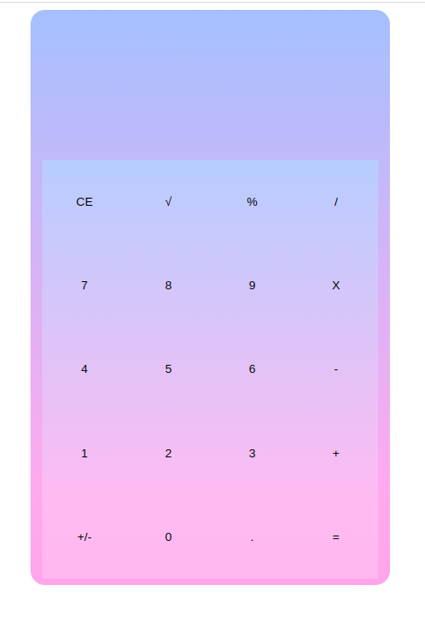
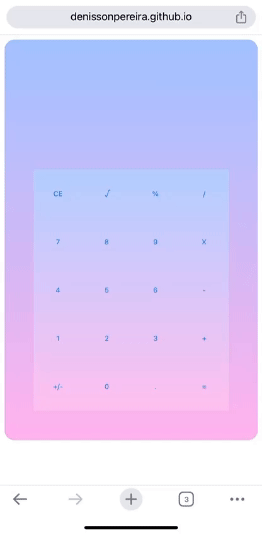
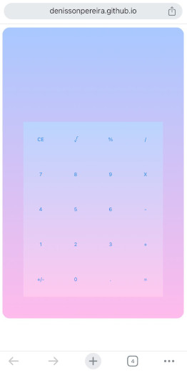

# 🧮 Simple-Calculator

# 🔍 Explore a Aplicação em Funcionamento

Convidamos você a explorar a aplicação **Simple-Calculator** em sua versão online: 

# 📑 Sobre o projeto 

O **Simple-Calculator** é uma simples aplicação de calculadora desenvolvida em JavaScript, oferecendo funcionalidades básicas de cálculos matemáticos. Com uma interface amigável e intuitiva, permite que os usuários realizem operações de adição, subtração, multiplicação e divisão de maneira rápida e eficiente. Uma ferramenta prática para cálculos do dia a dia.

## 📸 Visuals and Screenshots

Dê uma espiada nas imagens abaixo para ter uma prévia visual do projeto em ação. As capturas de tela oferecem um vislumbre das principais características e do design envolvente.

### 💻 Layout web
 

### 📱 Layout mobile
  

## 📚 Stack Tecnológica

## 🌐 Implantação em produção

- Web: `GitHub Pages`

## 🚨 Aguarde! Ainda não terminou!

>O Simple-Calculator é um projeto aberto e inclusivo, oferecendo a todos a oportunidade de utilizar e participar ativamente do seu desenvolvimento. Concebido como uma calculadora simples, este projeto acolhe contribuições de indivíduos interessados em aprimorar a funcionalidade, a interface ou qualquer outro aspecto do software. Seja você um usuário em busca de uma ferramenta prática ou um entusiasta da programação desejando colaborar, todos são bem-vindos a explorar, utilizar e contribuir para o Simple-Calculator. A diversidade de perspectivas e experiências é valorizada, enriquecendo a evolução contínua deste projeto colaborativo.

## 📜 Licença

  

## ✏️ Autor 

Denisson Pereira Santos

 
 
 
 

&nbsp;&nbsp;